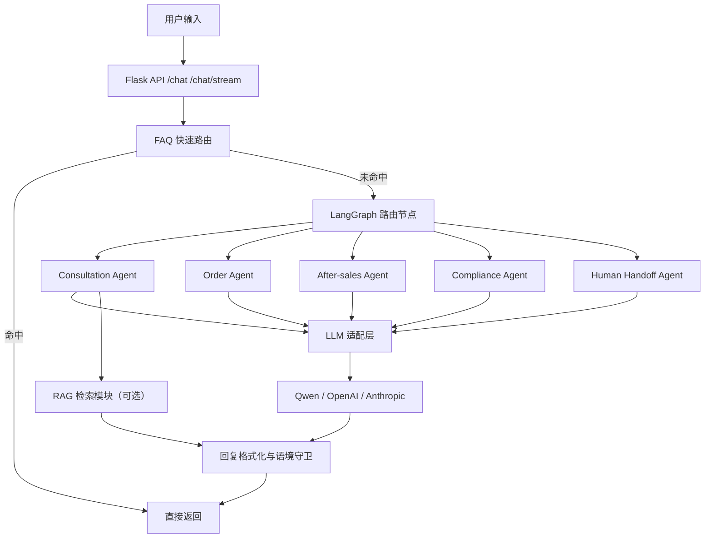

# B2C Agent
## 🌍 跨境电商多平台多语言智能客服（CarPlay / Android Auto）

一个基于 **Flask + LangGraph** 的多 Agent 智能客服 Demo，聚焦跨境电商业务，支持 **Amazon / Shopify / eBay / 官网**，覆盖咨询、订单、物流、售后、合规全流程。

- 📄 项目技术展示文档：[`docs/TECH_SHOWCASE.md`](docs/TECH_SHOWCASE.md)
- 🖼️ Demo 截图：`docs/demo (1).png` ~ `docs/demo (5).png`

---

## ⚡ 30 秒快速体验

```bash
docker build -t b2c-agent-demo:latest .
docker run --rm -p 5000:5000 --env-file .env b2c-agent-demo:latest
```

浏览器打开：`http://localhost:5000`

---

## ✨ 功能特性

- 🤖 **多 Agent 协同**：咨询 / 订单 / 售后 / 合规 / 人工转接
- 🚀 **FAQ 秒回**：高频问题毫秒级响应
- 💬 **情绪识别与语气切换**：根据用户语气自动调整表达
- 🌐 **多语言支持**：中文、英文、西语、德语、法语、日语、泰语、越语
- 🧭 **跨境语境守卫**：输出聚焦 Amazon/Shopify/eBay/官网 + CarPlay 主题
- ⌨️ **流式输出**：实时打字效果，提升交互体验
- 🧠 **模型可切换**：Qwen / OpenAI / Anthropic
- 📦 **Docker 化部署**：便于本地演示与云端交付

---

## 🎬 Demo 展示

### 1) FAQ 秒回场景
.png)

### 2) 路由与回复效果
.png)

### 3) 主对话界面
.png)

### 4) 多语言与语气风格
.png)
.png)

---

## 🧱 技术架构（简版）



---

## 🛠️ 技术栈

- **Backend**: Python 3.11, Flask
- **Orchestration**: LangGraph, LangChain Core
- **LLM**: Qwen / OpenAI / Anthropic
- **RAG (可选)**: ChromaDB + BM25
- **Frontend**: HTML / CSS / JavaScript
- **Deployment**: Docker

---

## 🚀 部署与使用

### 1) 本地运行

```bash
pip install -r requirements.txt
python src/app.py
```

访问：`http://localhost:5000`

### 2) 环境变量

复制 `.env.example` 为 `.env` 并配置至少一个模型 Key：

```env
QWEN_API_KEY=your_qwen_api_key
# 或
OPENAI_API_KEY=your_openai_api_key
```

> 建议：（例如 `VECTOR_DB_PROVIDER=chromadb`），不要在同一行末尾写注释。

---

## 📁 项目结构

```text
src/
├─ agents/                # 多 Agent 逻辑与系统提示词
├─ app.py                 # Flask 主入口（标准/流式接口）
├─ streamlit_app.py       # Streamlit 演示入口
├─ config/                # 配置管理
├─ state/                 # 会话状态定义
├─ tools/                 # 工具注册
└─ rag/                   # RAG 检索模块（可选）

docs/
├─ TECH_SHOWCASE.md       # 技术展示文档
└─ demo (1).png ...       # Demo 截图

init_knowledge_base.py    # （可选）知识库初始化脚本
```

---

## 📈 性能与优化

- FAQ 快速路由，缩短高频问题响应时延
- 会话级上下文管理，减少重复表达
- 流式输出降低用户等待感知
- 回复长度自适应（简短问题更短，复杂问题更完整）
- 语境守卫减少跑题输出

---

## 🧩 高级功能 / 可扩展

### 可选：知识库初始化（RAG）
项目保留了 `init_knowledge_base.py` 作为可选高级能力脚本，用于：
- 初始化跨境电商知识库目录与示例内容
- 为后续 RAG 检索模块提供基础语料
- 支持面向真实业务的知识扩展（政策、物流、售后文档等）

使用方式（可选）：

```bash
python init_knowledge_base.py
```

> 说明：该脚本不是系统启动必需项；即使不执行，也不影响基础聊天 Demo 运行。


## 📄 License
MIT


## 🙏 致谢

- [LangChain](https://github.com/langchain-ai/langchain)
- [ChromaDB](https://github.com/chroma-core/chroma)
- [BGE-M3](https://github.com/FlagOpen/FlagEmbedding)
- [FastAPI](https://github.com/tiangolo/fastapi)
