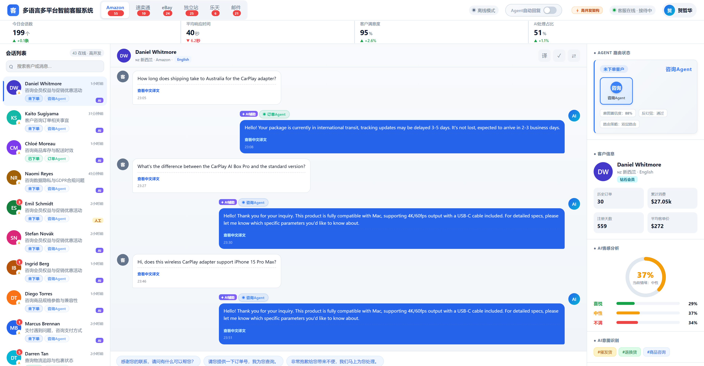

# 多语言多平台智能客服系统

基于多智能体（LangGraph）+ RAG + Qwen2.5-7B QLoRA 微调 + AWQ 量化 + vLLM 高并发推理的跨境 B2C 多语言智能客服参考实现。

覆盖欧美、东南亚 12 国 8 种语言，支持独立站 + 亚马逊等多平台会话统一接待，提供咨询、订单、售后、复购、人工转接 5 大核心智能体的全流程自动化编排。



## 核心特性

- **多智能体协作链**：基于 LangGraph 构建 5 大核心智能体，通过能力边界检测 + 转交上下文 + retry/rollback 形成协作升级链（咨询→订单→售后→人工），全程 trace 可追溯
- **RAG 质量评估 + 反幻觉**：混合检索（向量 + BM25 + RRF 融合）+ Cross-Encoder 重排序；Recall@K/MRR/NDCG 学术指标量化检索质量；三层反幻觉防护（引用溯源 + 置信度阈值 + 答案一致性校验）
- **模型微调与量化**：Qwen2.5-7B QLoRA 4-bit 量化微调；BLEU/ROUGE/五维质量评分量化微调收益；AWQ 量化部署
- **高并发推理**：基于 vLLM 实现高并发推理部署
- **多语言实时翻译**：8 种语言实时互译，客服中文输入自动翻译为目标语言
- **AI 辅助能力**：情感分析（分级关键词 + 强度修饰词）、意图识别、智能建议回复

## 技术栈

| 层级 | 技术选型 |
|------|---------|
| 前端 | 原生 HTML + CSS + JavaScript（单页应用，与后端 WebSocket 实时通信） |
| 后端 | Python 3.10+ / FastAPI / LangGraph / LangChain |
| 向量库 | Milvus 2.x（支持混合检索） |
| 模型 | Qwen2.5-7B（基座）/ QLoRA 4-bit 微调 / AWQ 量化 |
| 推理 | vLLM（高并发批处理推理） |
| 部署 | Docker / Docker Compose 一键启动 |

## 项目结构

```
multilang-cs-platform/
├── frontend/              # 前端单页应用
├── backend/               # FastAPI 后端 + LangGraph 多智能体
│   └── app/
│       ├── api/           # REST + WebSocket 接口
│       ├── agents/        # 5 大核心智能体
│       ├── rag/           # RAG 检索增强链路
│       ├── services/      # LLM/翻译/情感/意图服务
│       └── data/          # 内置多语言知识库
├── training/              # QLoRA 微调 + AWQ 量化脚本
├── deployment/            # Docker + vLLM + Milvus 部署配置
└── scripts/               # 环境初始化与启动脚本
```

## 快速开始

### 一、环境准备

```bash
# 克隆项目
git clone <repo-url>
cd multilang-cs-platform

# 复制环境变量
cp .env.example .env
```

### 二、方式 A：Docker 一键启动（推荐）

```bash
docker-compose up -d
```

启动完成后访问：http://localhost:8080

### 三、方式 B：本地开发启动

```bash
# 1. 安装后端依赖
cd backend
pip install -r requirements.txt

# 2. 启动后端服务
uvicorn app.main:app --host 0.0.0.0 --port 8000 --reload

# 3. 启动前端（使用 serve.py，自动禁用浏览器缓存）
cd ../frontend
python serve.py 8080
```

访问：http://localhost:8080

> **Windows 一键启动**：双击 `start.ps1` 或在 PowerShell 中执行 `.\start.ps1`，自动检测端口冲突、启动前后端服务。
>
> 后端支持多种 LLM 后端：在 `.env` 中配置 `LLM_PROVIDER=deepseek` 并填入 `DEEPSEEK_API_KEY` 即可接入 DeepSeek API。也支持 vLLM / OpenAI / 通义千问 / 自定义。未配置任何 API 时自动回退至规则引擎模式。

## 模型微调与量化

```bash
# QLoRA 4-bit 微调
cd training/qlora
python train.py --config configs/qwen2.5_7b_qlora.yaml

# AWQ 量化
cd ../quantization
python awq_quantize.py --model-path <qlora-output> --config configs/awq_config.yaml
```

详见 `training/` 目录文档。

## 质量评估

### RAG 检索质量 + 反幻觉验证

```bash
python scripts/eval_rag.py              # 文本报告
python scripts/eval_rag.py --json       # JSON 输出（CI 集成）
```

输出 Recall@K / MRR / NDCG / Precision 指标，并执行三层反幻觉验证（引用溯源 + 置信度阈值 + 答案一致性校验）。

### 微调效果对比

```bash
python scripts/eval_finetune.py --mode compare    # 预置基准对比报告
python scripts/eval_finetune.py --mode live       # 实时调用 vLLM 对比（需 vLLM 可用）
```

输出 BLEU-4 / ROUGE-L / 五维质量评分的三模型（基座→微调→量化）对比。

## vLLM 部署

```bash
cd deployment/vllm
bash serve.sh
```

详见 `deployment/vllm/` 目录文档。

## 系统架构

详见 `docs/architecture.md`。

## 测试与持续集成

### 单元测试

```bash
cd backend
pip install -r requirements-dev.txt
pytest tests/ -v --tb=short
```

覆盖 74 项测试用例，包含：

| 模块 | 测试文件 | 覆盖能力 |
|------|---------|---------|
| 多语言预处理 | `test_multilingual.py` | 语言识别（8 种）、NFKC 归一化、分区路由 |
| 意图识别 | `test_intent.py` | 双层识别、置信度评分、10 类意图覆盖 |
| 反幻觉校验 | `test_anti_hallucination.py` | 引用溯源、置信度分档、事实一致性、回复标注 |
| 上下文总线 | `test_context_bus.py` | 滑动窗口、意图聚焦、上下文摘要 |
| 监控指标 | `test_metrics.py` | 指标采集、Prometheus exposition、满意度计算 |
| 检索引擎 | `test_retriever.py` | CoT 查询扩展、RRF 融合、去重、分词 |

### GitHub Actions CI

```yaml
# .github/workflows/ci.yml
matrix: [Python 3.10, Python 3.11]
steps: install → compile check → pytest → coverage upload
```

每次 push / PR 自动触发，确保代码质量门禁。

## 监控与可观测性

### Prometheus 指标

系统内置 Prometheus 兼容指标端点，无需额外依赖：

```bash
# 获取指标
curl http://localhost:8000/metrics
```

核心指标：

| 指标 | 说明 |
|------|------|
| `cs_total_requests` | 请求总数 |
| `cs_avg_response_ms` | 平均响应时延（毫秒） |
| `cs_intent_distribution{intent}` | 意图分布 |
| `cs_agent_distribution{agent}` | Agent 处理分布 |
| `cs_anti_hallucination_pass_rate` | 反幻觉通过率 |
| `cs_handoff_rate` | 人工转接率 |
| `cs_negative_sentiment_count` | 负面情感计数 |

### 统计面板

```bash
curl http://localhost:8000/api/stats
```

返回实时运营指标，包括请求量、响应时延、Agent 分布、反幻觉通过率、人工转接率等，前端可视化大屏直接消费。

## 安全配置

### CORS 跨域策略

生产环境通过环境变量配置允许的前端域名，严禁使用通配符：

```bash
# .env
CORS_ALLOWED_ORIGINS=https://cs.example.com,https://admin.example.com
```

开发环境默认允许 `localhost:8080/5173/3000`，仅放行 `GET/POST/PUT/DELETE/OPTIONS` 方法和必要的请求头。

### API 鉴权

生产部署建议在反向代理层（Nginx / API Gateway）添加 JWT 或 API Key 鉴权，后端通过 `X-Request-ID` 头支持链路追踪。

## License

Apache License 2.0
