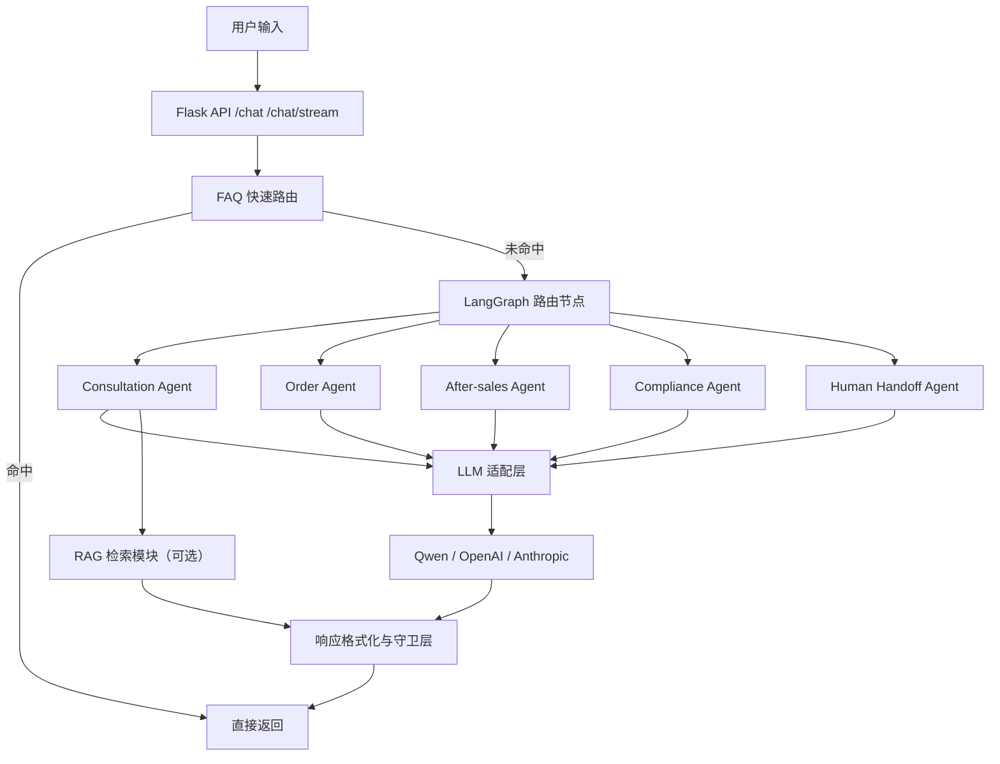

# 跨境电商多平台多语言智能客服（CarPlay 行业）技术展示

## 1. 项目名称
**B2C Agent Demo：跨境电商多平台多语言智能客服系统（CarPlay / Android Auto）**

---

## 2. Demo 展示核心功能

### 2.1 多 Agent 智能路由与处理
- 自动识别用户意图（咨询 / 订单 / 售后 / 合规 / 人工转接）
- 基于 LangGraph 路由到对应专业 Agent

### 2.2 FAQ 秒回 + 流式输出
- 常见问题（退货、物流、退款、兼容性）走快速路由
- 非 FAQ 问题走完整 Agent 流程
- 支持流式输出，实时打字效果

### 2.3 情绪识别与语气切换
- 识别用户情绪（急迫 / 焦虑 / 不满 / 礼貌 / 中性）
- 自动切换表达方式，保持专业且有人情味

### 2.4 多语言能力
- 支持中、英、西、德、法、日、泰、越
- 根据用户输入自动适配回复语言

### 2.5 跨境语境强约束
- 固定在 Amazon / Shopify / eBay / 官网场景
- 固定在 CarPlay / Android Auto 车载产品主题
- 过滤国内平台与偏题话术

### Demo 截图
.png)
.png)
.png)
.png)
.png)

---

## 3. 项目背景
跨境电商客服在多平台、多语言、高并发场景下常见问题：
- 问题类型跨度大（咨询、物流、售后、政策）
- 用户表达不规范、情绪波动明显
- 人工客服成本高、响应时延大

本项目目标是构建一套 **可演示、可扩展、可部署** 的智能客服系统：
- 保证响应速度
- 保持跨境业务准确性
- 支持后续接入真实业务系统

---

## 4. 核心功能亮点
1. **LangGraph 多 Agent 编排**：结构清晰，易扩展
2. **双通道响应**：FAQ 秒回 + Agent 深度处理
3. **情绪驱动话术**：兼顾效率与用户体验
4. **平台与主题守卫**：输出更稳定，减少“跑题”
5. **会话上下文能力**：路由切换时保持连续性
6. **容器化交付**：支持 Docker 快速部署与演示

---

## 5. 技术架构



### 组件作用与数据流（简述）
- **Flask API**：接收请求、维护会话上下文、返回标准/流式结果
- **FAQ 路由**：对高频问题毫秒级响应
- **LangGraph**：将复杂问题分配到专业 Agent
- **LLM 适配层**：统一对接多个模型供应方
- **RAG（可选）**：补充知识检索能力
- **格式化守卫层**：做语气、语言、平台语境、输出规范化

---

## 6. 技术栈
- **Backend**: Python 3.11, Flask
- **Agent Orchestration**: LangGraph, LangChain Core
- **LLM**: Qwen / OpenAI / Anthropic（可切换）
- **RAG**: ChromaDB + BM25（可选）
- **Frontend**: HTML/CSS/JavaScript（含流式展示）
- **Deployment**: Docker

---

## 7. 部署与使用

### 本地运行
```bash
pip install -r requirements.txt
python src/app.py
```
访问：`http://localhost:5000`

### Docker 运行
```bash
docker build -t b2c-agent-demo:latest .
docker run --rm -p 5000:5000 --env-file .env b2c-agent-demo:latest
```

### Docker 版本标签建议
```bash
docker tag b2c-agent-demo:latest <your-dockerhub-username>/b2c-agent-demo:v1.0.0
docker push <your-dockerhub-username>/b2c-agent-demo:v1.0.0
```

---

## 8. 项目结构

```text
src/
├─ agents/                # 多 Agent 逻辑与系统提示
├─ app.py                 # Flask 主入口（API + 流式 + 格式化）
├─ streamlit_app.py       # Streamlit 演示入口
├─ config/                # 配置管理
├─ state/                 # 会话状态定义
├─ tools/                 # 工具注册与调用
└─ rag/                   # RAG 检索模块（可选）

docs/
├─ demo (1).png ...       # Demo 展示截图
└─ TECH_SHOWCASE.md       # 技术展示文档
```

---

## 9. 性能与优化
- FAQ 快速路由，缩短常见问题响应时延
- 会话级缓存与轻量状态管理
- 流式输出减少用户等待感知
- 响应长度自适应，避免冗长
- 模型与平台语境守卫，提升输出稳定性

---

## 10. 可扩展方向
- 接入真实订单/物流系统 API
- 接入客服工单系统（SLA、标签、优先级）
- 增加对话质检（违规检测、满意度预测）
- 引入 A/B 评估与监控看板
